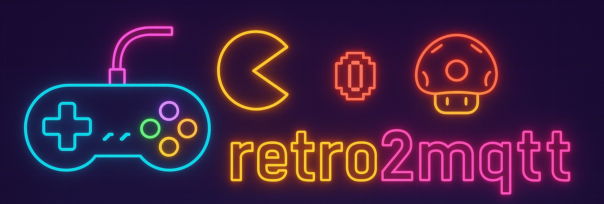

[](https://github.com/ezand/retro2mqtt/actions/workflows/build.yml)
[](https://choosealicense.com/licenses/mit/)


> ⚠️ **Work in Progress**: This project is under active development and not ready for production use. Features may be
> incomplete, APIs may change, and bugs are expected.

# retro2mqtt

An application that bridges retro gaming systems to MQTT, enabling real-time monitoring and automation of retro
gaming sessions.

## 👀 Overview

retro2mqtt monitors retro gaming platforms and publishes detailed information about gaming sessions to MQTT topics. This
enables home automation systems, status displays, and other integrations to respond to gaming activity in real-time.

The application extracts information from multiple sources:

- **Platform log files** - Real-time monitoring of emulator activity and system information
- **ROM files** - Metadata extraction from game files (title, region, ROM type, etc.)
- **Platform metadata** - Core information, system specifications, and configuration details

### Supported Platforms

Currently supported:

- **[RetroArch](https://www.retroarch.com/)** - Comprehensive support for log monitoring and ROM analysis. See the [RetroArch configuration guide](docs/retroarch.md) for setup instructions.
- **[LaunchBox / BigBox](https://www.launchbox-app.com/)** - Integration via the [launchbox2mqtt](https://github.com/ezand/launchbox2mqtt/) plugin. See the [LaunchBox configuration guide](docs/launchbox.md) for setup instructions.
- **[audio2mqtt](https://github.com/ezand/audio2mqtt)** - Audio playback monitoring and MQTT integration for capturing in-game events. See the [audio2mqtt configuration guide](docs/audio2mqtt.md) for setup instructions.

Planned / potential support:

- **[HyperSpin](https://hyperspin-fe.com/)**
- **[EmulationStation](https://emulationstation.org/) / [ES-DE](https://es-de.org/)**
- **[Attract‑Mode](https://attractmode.org/)**
- **[Pegasus](https://pegasus-frontend.org/)**

## Setup

### 📡 MQTT Broker

You'll need an [MQTT](https://mqtt.org/) broker running and accessible. Popular options include:

- [Mosquitto](https://mosquitto.org/)
- [HiveMQ](https://www.hivemq.com/)
- [EMQX](https://www.emqx.com/)

### 🏠 Home Assistant Integration

retro2mqtt supports [MQTT Discovery](https://www.home-assistant.io/integrations/mqtt/#mqtt-discovery) for seamless
[Home Assistant](https://www.home-assistant.io/) integration. When enabled in the configuration, entities are
automatically created in Home Assistant without manual setup:

```edn
{:integrations {:home-assistant {:discovery? true}}}
```

With discovery enabled, gaming session information appears automatically as sensors in Home Assistant, enabling
automations based on what game you're playing, which core is running, and other metadata.

## 💻 Development

For information on building, running, and developing retro2mqtt, see the [Development Guide](docs/development.md).

## 📃 License

MIT License - see [LICENSE](LICENSE) file for details.
